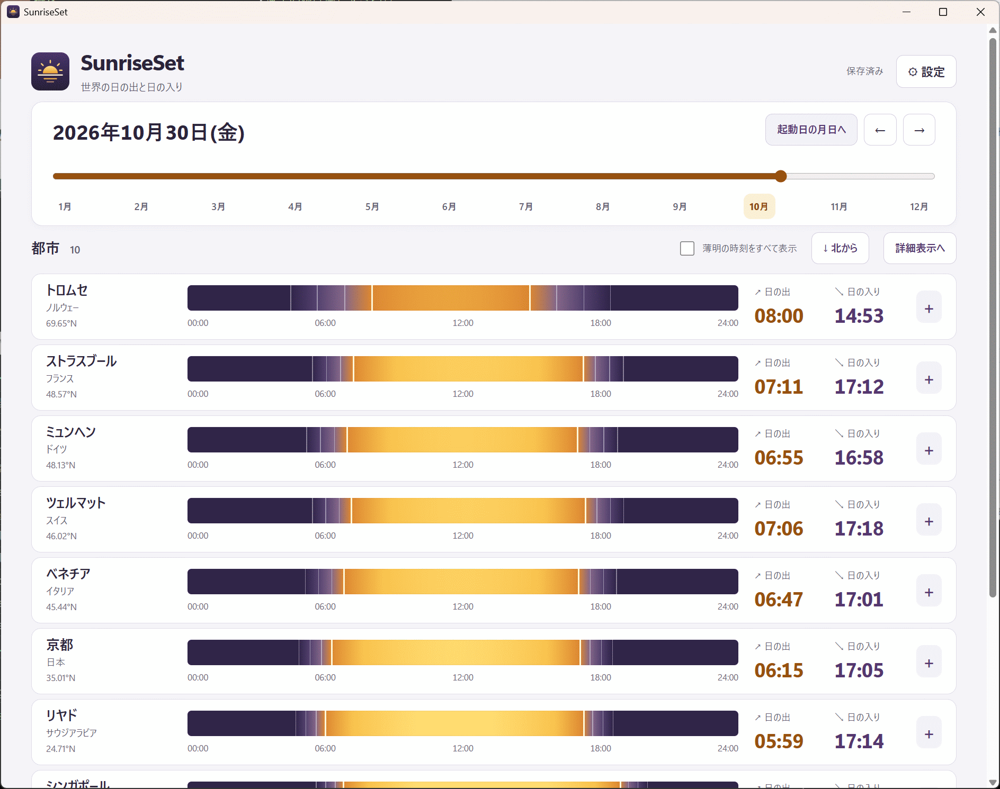

# SunriseSet

SunriseSetは、世界各地の日の出・日の入り・薄明の時刻を調べるWindows 11向けデスクトップアプリです。
日付と都市を選び、太陽の動きや各地の時刻を見比べられます。
天文計算はローカルで行うため、オフラインで利用できます。

[English README](README.md)

## スクリーンショット



## 使用言語・技術

- アプリケーション: Rust、TypeScript、Preact、HTML、CSS
- 都市データ: JSON
- ユーザー設定: TOML
- デスクトップ機能とパッケージ化: Tauri 2

## ビルドに必要な環境

- Windows 11、x64
- Node.js 22.18以降、npm
- MSVCターゲットを含むRust stableツールチェーン
- Visual Studio 2022 Build Tools（またはVisual Studio）、C++によるデスクトップ開発ワークロード、Windows SDK
- WebView2 Runtime

## ビルド手順

リポジトリのルートでPowerShellを開き、次を実行します。

```powershell
npm install
npm run tauri -- build
```

release版の実行ファイルは `src-tauri/target/release/sunriseset.exe` に生成されます。Windows用のMSIおよびNSISインストーラーは `src-tauri/target/release/bundle/` 以下に生成されます。

開発モードで起動する場合:

```powershell
npm run tauri -- dev
```

## 実行方法とファイルの保存場所

`sunriseset.exe` を起動するか、MSI／NSISインストーラーでインストールします。初回起動時、プロセスのカレントディレクトリに `cities.json` と `settings.toml` を作成します。実行ファイルのある場所とは異なる場合があります。実際の保存先は設定画面に表示されます。

設定画面での変更は、起動中の表示にすぐ反映されます。`保存する` ボタンを押すと `settings.toml` に書き込まれます。`cities.json` の編集はアプリを再起動すると反映されます。2回目以降の起動で既存ファイルを上書きすることはありません。

## 主な特徴

- 連続した日付スライダー、月ボタン、前日・翌日ボタンで選択年の日付を移動できます。
- 表示年は今年または来年から選べます。「今日」は起動時の端末のローカル日付を基準にします。
- 日の出・日の入りに加えて、天文・航海・市民薄明の境界時刻を表示します。
- 各イベントは現地時刻と、その日に適用されるUTCオフセットで確認できます。
- 同梱のIANAタイムゾーンデータを使い、タイムゾーンと夏時間の切り替えに対応します。
- 太陽高度に応じた一日のグラデーションと、最高高度を含む詳細表を表示します。
- 設定画面では地域フィルターと都市・国・地域名による検索を併用できます。
- 都市を北から／南から並べ替えられます。地域や国ごとの順序は都市JSONで編集できます。
- 日の出・日の入りがない地域は白夜・極夜として表示します。
- `cities.json` を編集して表示する代表地点を選べます。天文計算はオフラインで実行します。

