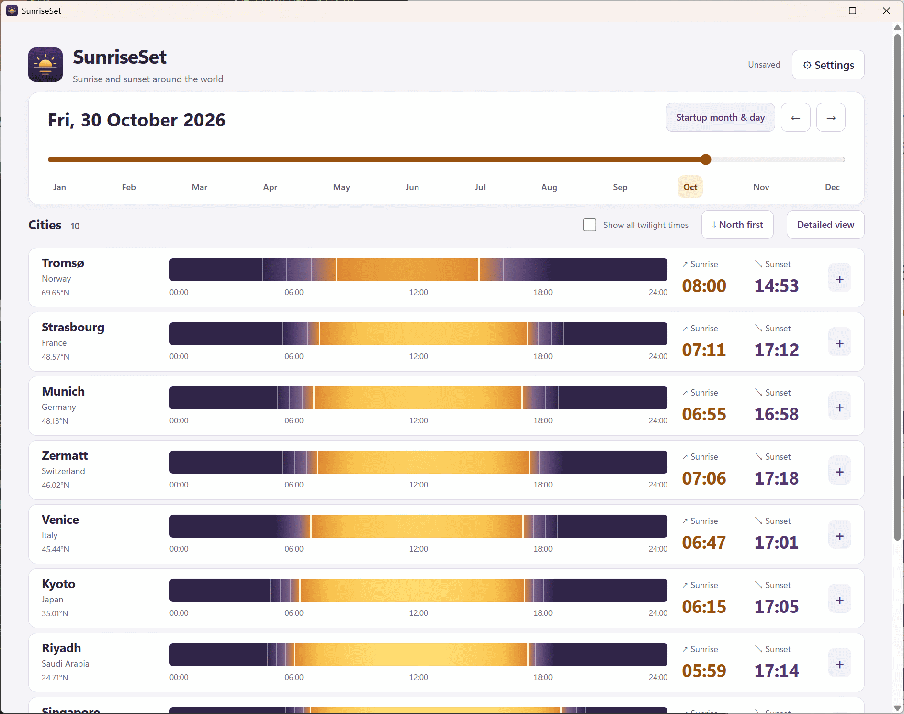

# SunriseSet

SunriseSet is a Windows 11 desktop app for exploring sunrise, sunset, and twilight times around the world.
Choose a date and locations to compare the Sun's daily path, with times shown in each location's local time.
Solar events are calculated locally, so the app works offline.

[日本語版 README](README-ja.md)

## Screenshot



## Languages and technologies

- Application: Rust, TypeScript, Preact, HTML, and CSS
- City catalog: JSON
- User settings: TOML
- Desktop shell and bundling: Tauri 2

## Build requirements

- Windows 11, x64
- Node.js 22.18 or later and npm
- Rust stable toolchain with the MSVC target
- Visual Studio 2022 Build Tools (or Visual Studio) with the **Desktop development with C++** workload and Windows SDK
- WebView2 Runtime

## Build

Open PowerShell in the repository root and run:

```powershell
npm install
npm run tauri -- build
```

The release executable is written to `src-tauri/target/release/sunriseset.exe`. Tauri also creates Windows MSI and NSIS installers under `src-tauri/target/release/bundle/`.

To run the app in development mode:

```powershell
npm run tauri -- dev
```

## Run the app and find its files

Launch `sunriseset.exe` or install the MSI/NSIS package. On first launch, SunriseSet places `cities.json` and `settings.toml` in the process's current working directory. This can differ from the executable's folder. The Settings screen shows the actual directory.

Changes made in Settings are used in the current session. Press **Save changes** (Japanese: **保存する**) to write them to `settings.toml`. The city catalog can be edited as JSON; restart the app to load catalog edits. Existing files are preserved on subsequent launches.

## Features

- Browse any date in the selected year with a continuous date slider, month shortcuts, and previous/next-day controls.
- Choose this year or next year; the startup date is based on the device's local date when the app launches.
- View sunrise and sunset alongside astronomical, nautical, and civil twilight boundaries.
- Read event times in each city's local time, including the UTC offset used on that date.
- Account for time zones and daylight-saving transitions using the bundled IANA time-zone database.
- Compare locations with a daily Sun-altitude gradient and a detailed table that includes maximum solar altitude.
- Filter the city picker by world region and search by city, country, or region name.
- Sort locations north-to-south or south-to-north; the catalog also supports manually curated regional and country ordering.
- Show polar day and polar night when sunrise or sunset does not occur.
- Select and reorder representative locations by editing `cities.json`; solar calculations run offline.

